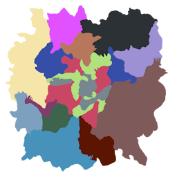

# Adding Custom Biomes

This guide provides information on how biomes function in Subnautica and how you can start adding your own biomes!

Are you looking for information on creating a biome by hand? Sculpting terrain and placing large numbers of props to populate entire regions of the world goes beyond the scope of Nautilus. If you need a solution to create the level design for a new custom biome by hand, see other mods/programs such as [Abyss Editor](https://www.nexusmods.com/subnautica/mods/3298) and the [Mod Structure Helper](https://www.nexusmods.com/subnautica/mods/1665).

# What Is a Biome?

There is no singular concept of biomes in Subnautica.
For the purposes of this guide, a "biome" refers to the location-specific strings that affect the visuals and soundscape of the game.
You can see your current in-game biome in the F1 debug menu.
There you will see the "LD biome" and the "player biome".

## The "Player Biome"

The player biome determines what music and ambience will play at any given moment. The player biome is based on the LD biome, but can be overriden by being inside of an observatory, the Aurora, precursor base, etc.

The player biome is also used in the rich presence calculation, ghost leviathan spawning, and some other mechanics.

You can quickly poll the player biome string at any time by calling `Player.main.GetBiomeString()`.

## The "LD Biome"

The "LD" or 'level design' biome primarily determines the fog and temperature and is tied to the camera, not the player. An instance of the `WaterscapeVolume.Settings` class exists for each of these, with settings such as the wavelength absorption, murkiness, and start distance.

If the player is inside one or more atmosphere volumes, the volume with the highest priority will be used as the LD biome.

If the player is not in any atmosphere volume, the LD biome will first be determined by the 2D biome map. It can then be overridden by being in a specific batch. Every batch has the `LargeWorldBatchRoot` component, which has an `overrideBiome` string field. The override is typically not set at the surface, but some cave systems such as the Lost River use batch-level overrides.

The game's method of calculating this is roughly:
```csharp
private static string CalculateLevelBiome()
{
    string biomeOverride = AtmosphereDirector.main.GetBiomeOverride();
    if (!string.IsNullOrEmpty(biomeOverride))
    {
        return biomeOverride;
    }
    return LargeWorld.main.GetBiome(position); // position of camera or player (depends)
}
```



*The 2D Biome Map used by the game for surface biome.*

## Waterscape Volume Settings

The `WaterscapeVolume.Settings` class from Subnautica has the following settings:

| Property name     | Default value                   | Explanation                                              |
| ----------------- |---------------------------------|----------------------------------------------------------|
| `absorption`      | `(100f, 18.29155f, 3.531373f)`  | Attenuation coefficients of light (1/cm).                |
| `scattering`      | `1f`                            | The intensity of light scattering.                       |
| `scatteringColor` | `Color.white`                   | The color of the scattering. Affected by absorption.     |
| `murkiness`       | `1f`                            | Higher values reduce visibility.                         |
| `emissive`        | `Color.black`                   | The emission color. Typically very dim or black.         |
| `emissiveScale`   | `1f`                            | The multiplier for the emission color.                   |
| `startDistance`   | `25f`                           | The distance in meters from the camera where fog begins. |
| `sunlightScale`   | `1f`                            | Scale applied to the sunlight.                           |
| `ambientScale`    | `1f`                            | Scale applied to the ambient lighting.                   |
| `temperature`     | `24f`                           | Temperature in Celsius.                                  |

All settings used by the game are listed [on this page](biome-setting-references.md).

## Atmosphere Volumes
Atmosphere volumes are the easiest way to put modded biomes in the world.
While inside of its collider, the player's biome will be set to its `overrideBiome` value.
It also affects the camera, meaning the LD biome is set appropriately.

Atmosphere volumes are essentially large trigger colliders with the `AtmosphereVolume` component.
The `overrideBiome` field and priority must be set.
They should also be on the trigger layer (layer 21).

---

# Creating New Biomes

## Creating Waterscape Settings
Waterscape Volume settings affect the appearance of the fog and the temperature.

You can manually create an instance of the `WaterscapeVolume.Settings` class and initialize the needed fields.
To construct it in one line, you can also use the [BiomeUtils.CreateBiomeSettings](xref:Nautilus.Utility.BiomeUtils) method.

```csharp
// Settings for a very dark cave with no ambient lighting and no sunlight.
WaterscapeVolume.Settings settings = BiomeUtils.CreateBiomeSettings(
    new Vector3(20, 10, 6), 0.7f, Color.white, 0.37f, new Color(0, 0, 0), 1, 7, 0, 0, 21);
```

## Registering Biome Settings

Use the [BiomeHandler](xref:Nautilus.Handlers.BiomeHandler) to register your custom biome to be recognized by the game.

```csharp
// Registers a custom biome that uses the settings defined earlier and the Grand Reef sky
BiomeHandler.RegisterBiome("mycustombiome", settings, new BiomeHandler.SkyReference("SkyGrandReef"));
```

## Creating Atmosphere Volumes
You can use the [AtmosphereVolumeTemplate](xref:Nautilus.Assets.PrefabTemplates.AtmosphereVolumeTemplate) prefab class to quickly create your own atmosphere volume prefabs.
You must place them in the world and scale them up sufficiently to have any noticeable effect.

```csharp
// Example code for registering an Atmosphere Volume prefab that uses the Kelp Forest biome
CustomPrefab prefab = new CustomPrefab(PrefabInfo.WithTechType("MyKelpForestVolume"));
AtmosphereVolumeTemplate template = new AtmosphereVolumeTemplate(prefab.Info,
    AtmosphereVolumeTemplate.VolumeShape.Sphere, "kelpForest", priority: 10);
prefab.SetGameObject(template);
prefab.Register();
```

```csharp
// Example code for registering an Atmosphere Volume prefab with our own biome!
CustomPrefab prefab = new CustomPrefab(PrefabInfo.WithTechType("NautilusExampleBiomeVolume"));
AtmosphereVolumeTemplate template = new AtmosphereVolumeTemplate(prefab.Info,
    AtmosphereVolumeTemplate.VolumeShape.Sphere, "mycustombiome", priority: 10);
prefab.SetGameObject(template);
prefab.Register();
```

Common methods of spawning atmosphere volumes include the Coordinated Spawns system, or the Mod Structure Helper while
using the DebugHelper's `showcolliders` command.

## Setting Music and Ambience

Use the [BiomeHandler](xref:Nautilus.Handlers.BiomeHandler) to set the music and ambience for a modded biome.
Note that biome music and ambience uses a prefix to match, not equivalence. So if you have a biome named `kelpForestTWO`,
the normal Kelp Forest music will still play there. Likewise, if you register music for a biome called "kelp", that will
affect ALL biomes with a name that begins with the word "kelp."

```csharp
// Music
BiomeHandler.AddBiomeMusic("mycustombiome", AudioUtils.GetFmodAsset("SomeFmodEventThatMustBeRegisteredElsewhere"));

// Ambience
BiomeHandler.AddBiomeAmbience("mycustombiome", AudioUtils.GetFmodAsset("AnotherFmodEventThatMustBeRegisteredElsewhere"),
    FMODGameParams.InteriorState.OnlyOutside);
```

> [!NOTE]
> This approach alone will not affect the current music or ambience when the player's biome is overriden by being inside the Aurora, in an observatory, or while walking inside a precursor base.